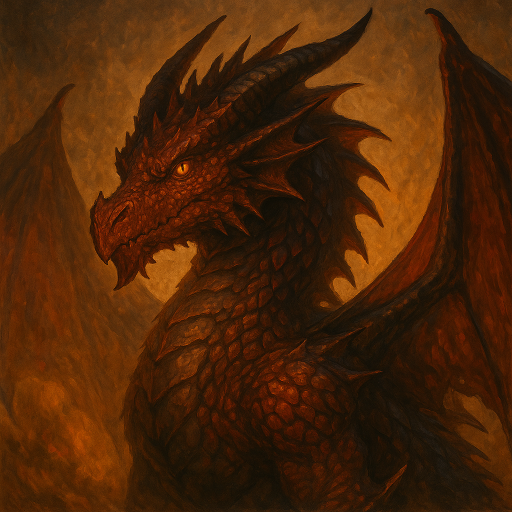

# 🐉 LLM D&D RolePlay Game

An AI-powered Dungeons & Dragons experience where players interact with a Dungeon Master generated by local large language models. This project features an immersive role-playing interface powered by a dice system and multiple outcome generation.

## 🎮 Features

- 🎲 Roll-based outcome generation (1–6 scale from failure to epic success)
- 💬 AI-generated Dungeon Master responses using:
  - Hugging Face model (`Qwen/Qwen3-1.7B`)
  - Local LM-Studio API
- 🧠 Suggested next actions dynamically generated
- 🪄 Two versions included:
  - `Ai_dungeon_transformers_version.py` (Qwen on Hugging Face)
  - `tkinter_ai_dungeon_Lm_studio_version.py` (local OpenAI-compatible server)

## 🛠️ How to Run

1. Install dependencies:
   pip install transformers torch pydantic openai

2. Launch the Game
   
   python Ai_dungeon_transformers_version.py
   
    or with LM Studio API
   
   python tkinter_ai_dungeon_Lm_studio_version.py

4. Start your role-playing adventure!
